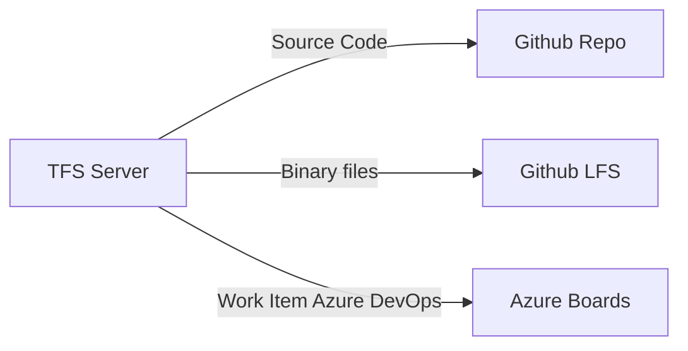

## Description:
TFS (Team Foundation Server) and Git are both version control systems that are used to manage source code. However, they have some fundamental differences in their architecture, workflow, and user interface.
Here are the general steps involved in migrating source code from TFS to Git:

- Export the source code from TFS: The first step is to extract the source code and its history from TFS. There are several tools available that can help you automate this process, including the TFS Integration Tools or the Git-TFS tool.

- Transform the source code: TFS and Git have different architectures and workflows, so you may need to transform the source code to make it compatible with Git. For example, you may need to convert TFS branches to Git branches, or translate TFS labels to Git tags.

- Import the source code into Git: Once you have transformed the source code, you can import it into Git. There are several ways to do this, including using the Git command-line tools or using a Git GUI tool such as Sourcetree or GitKraken.

- Verify the migration: After the migration is complete, you need to verify that the source code has been migrated correctly, including verifying that the commit history has been preserved, that the repository structure is correct, and that the project files are intact.

- Train the users: Finally, you need to train the users on how to use Git, including how to clone the repository, commit changes, create branches, merge code, and resolve conflicts.

## Flow Chart

## Pre-requisites:
#### python - Minimum 3.9 or Greater
#### packages - requirement.txt
#### Github credentials - 1. User id and token
#### git tfs 

## Code file details:
main.py - performs the source code migration and workitem migration.
library.py - defines the methods which are needed and reusability of methods across the execution.
credentials.py - defines the secrets / sensitive details in the file store.

## Program execution in sequential order: 
First of all we have to execute 

python main.py
This script will give a output list of all the repos that is there in remote tfs server.
It will give two txt file 
(a). output_dir.txt
     In this txt file we will get all the directory that is there in the project.
(b). output_file.txt
     In this txt file we will get all the files that is there in the project.
First this script will ask for a txt file for giving list of extension i.e.  output_file.txt
Then it will ask for a name of output file and it will give all the extension with file name and count of it.
This script will give a commit history Of a particular project that is in tfs server.
This script will create a new repo in github using user credentials and upload the tfs repos to git.

## Development in progress:

## Goals:
#### Migration of the Team Foundation Version Control[TFVC] source code with history of commits and branches to GitHUB repository.
#### Migration of the Team Foundation Version Control[TFVC] work items with history of issues and changes to Azure DevOps Services.

