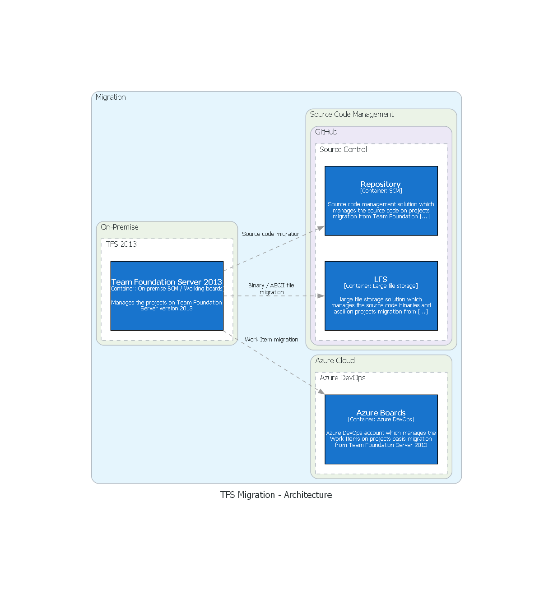
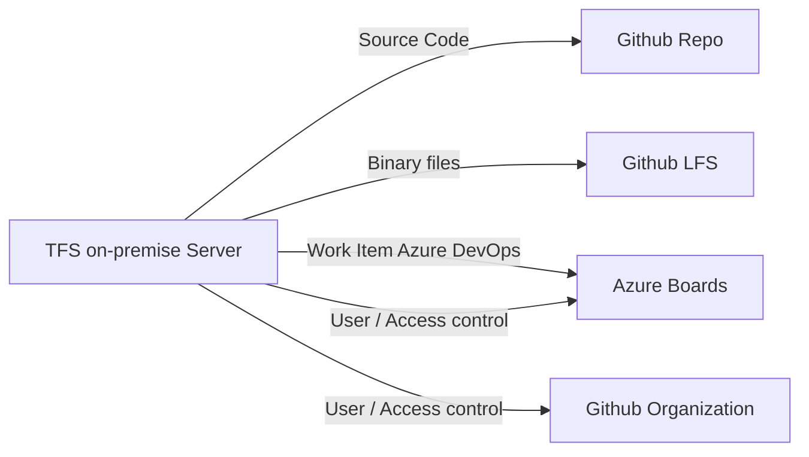

## Description:
TFS (Team Foundation Server) and Git are both version control systems that are used to manage source code. However, they have some fundamental differences in their architecture, workflow, and user interface. Here are the general steps involved in migrating source code, work items and user privileges from TFS to GitHub & ADO [Azure DevOps].

## Architecture

  

## Flow Chart

## Pre-requisites:
- python - Minimum 3.9 or Greater
- packages - requirements.txt
- Github credentials - 1. User id and token
- Ado credentials - Org, token
- git tfs
- Visual Studio 2013/2019/2022
- Team Foundation Power Tools Extension for Visual Studio

## Goals:
- Migration of the Team Foundation Version Control[TFVC] source code with history of commits and branches to GitHUB repository.
- Migration of the Team Foundation Version Control[TFVC] work items with history of issues and changes to Azure DevOps Services.
- Migration of the Team Foundation server [TFVC] User and access control to GitHUB and ADO