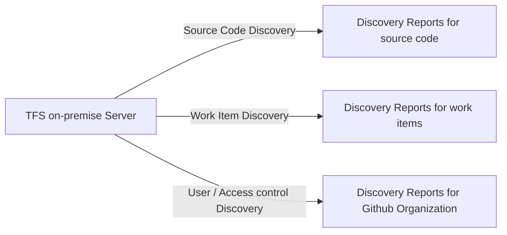

## Description:
TFS (Team Foundation Server) 2013 server discovery reports are generated for the active tfs transformation progress tracking.

## Flow Chart

## Pre-requisites:
- python - Minimum 3.9 or Greater
- packages - requirements.txt
- Github credentials - 1. User id and token
- Ado credentials - Org, token
- git tfs
- Visual Studio 2013/2019/2022
- Team Foundation Power Tools Extension for Visual Studio

## Code file details:
- main.py - performs the source code migration and workitem migration.
- library.py - defines the methods which are needed and reusability of methods across the execution.
- credentials.py - defines the secrets / sensitive details in the file store.

## Program execution in sequential order: 

> pip install -r requirements.txt

> python main.py

## Goals:
- Discovery of the Team Foundation Version Control[TFVC] source code with history of commits and branches to GitHUB repository.
- Discovery of the Team Foundation Version Control[TFVC] work items with history of issues and changes to Azure DevOps Services.
- Discovery of the Team Foundation server [TFVC] User and access control to GitHUB and ADO