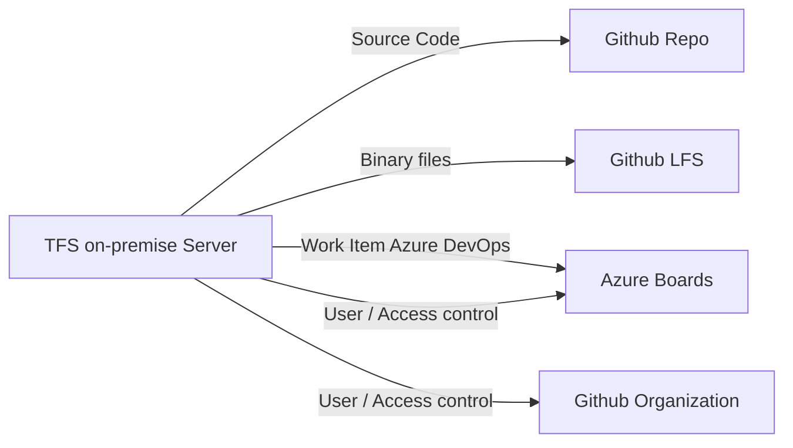

## Description:
TFS (Team Foundation Server) and Git are both version control systems that are used to manage source code. However, they have some fundamental differences in their architecture, workflow, and user interface. Here are the general steps involved in Discovery and migrating source code, work items and user privileges from TFS to GitHub & ADO [Azure DevOps]:

## - Discovery
- Discover the collection wise projects and get it as a report to be shared with the team.
- Discovery dir has the source code and the reports generated using the source code.

## -  Migration
- Migration of the source code from TFS to GitHUB organization repo.
- Migration dir has the source code and the reports generated using the source code.

## Flow Chart

## Pre-requisites:
- python - Minimum 3.9 or Greater
- packages - requirements.txt
- Github credentials - 1. User id and token
- git tfs 

## Code file details:
- main.py - performs the source code migration and work item migration.
- library.py - defines the methods which are needed and reusability of methods across the execution.
- credentials.py - defines the secrets / sensitive details in the file store.

## Program execution in sequential order: 
First of all we have to execute 

> pip install -r requirements.txt

> python main.py

This script will give a output list of all the repos that is there in remote tfs server. It will give two txt file 
- - output_dir.txt
     In this txt file we will get all the directory that is there in the project.
- - output_file.txt
     In this txt file we will get all the files that is there in the project.

First this script will ask for a txt file for giving list of extension i.e.  output_file.txt. Then it will ask for a name of output file and it will give all the extension with file name and count of it. This script will give a commit history Of a particular project that is in tfs server.

This script will create a new repo in github using user credentials and upload the tfs repos to git.

## Goals:
- Migration of the Team Foundation Version Control[TFVC] source code with history of commits and branches to GitHUB repository.
- Migration of the Team Foundation Version Control[TFVC] work items with history of issues and changes to Azure DevOps Services.
- Migration of the Team Foundation server [TFVC] User and access control to GitHUB and ADO