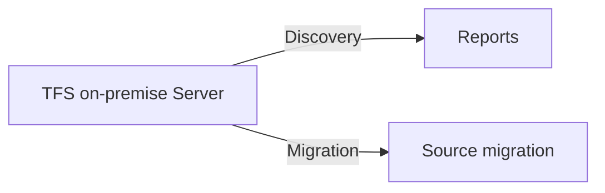

## Description:
This directory holds the files for the execution of discovery or source migration to be performed on TFS transformation.

## - Discovery
- Discover the collection wise projects and get it as a report to be shared with the team.
- Discovery dir has the source code and the reports generated using the source code.

## -  Migration
- Migration of the source code from TFS to GitHUB organization repo.
- Migration dir has the source code and the reports generated using the source code.

## Flow Chart

